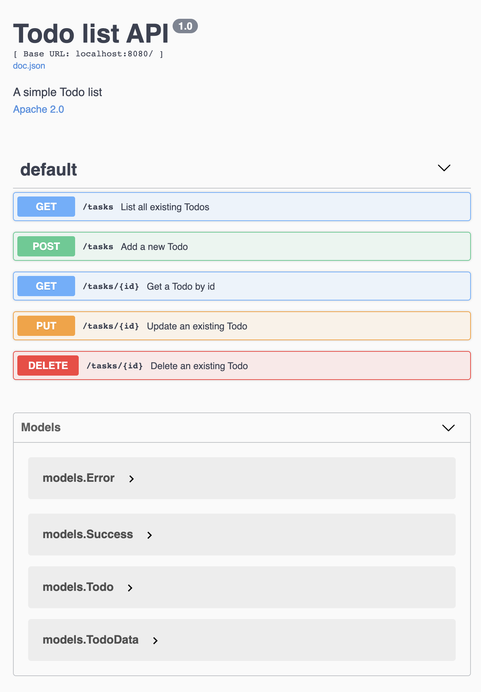

## Golang exploration

A simple Todo list server implementation, but explores:

1. [Gomodules](https://github.com/golang/go/wiki/Modules) for dep management
2. DDD-esque go-style project structuring
    - Pure `domain` module holds models, repos and services
    - `infra` module holds tech-specific `domain` implementations
    - `api` module defines controllers and modules, and uses `domain` constructs
    - `app` instantiates and holds components needed booting up a server in `main.go`; this module also knows about the 
      concrete `infra` and web framework used (kept web framework separate from `infra` because it's top-level and can change
      independently of other tech relatively easily)
3. Go test, with an eye on maximising testability by enabling mocking of interfaces.
4. Auto-generated Swagger/OpenAPI clients via [Swaggo](https://github.com/swaggo/swag)
5. Easy to understand dependency-injection by building a components graph by hand
6. The [Gin](https://gin-gonic.com) web framework

### Usage

### Running

1. [Install `Go`](https://golang.org/doc/install)
2. Clone this repo
3. `go run main.go` and hit the endpoints.
  - For Swagger, go to [localhost:8080/swagger/index.html](http://localhost:8080/swagger/index.html)
    

### Dev

1. [Install `Go`](https://golang.org/doc/install)
2. Use your favourite editor/IDE
3. For updating Swagger docs:
    1. Install [Swaggo](https://github.com/swaggo/swag#getting-started)
    2. Run `swag init` from the root project dir
    3. Commit the generated files.